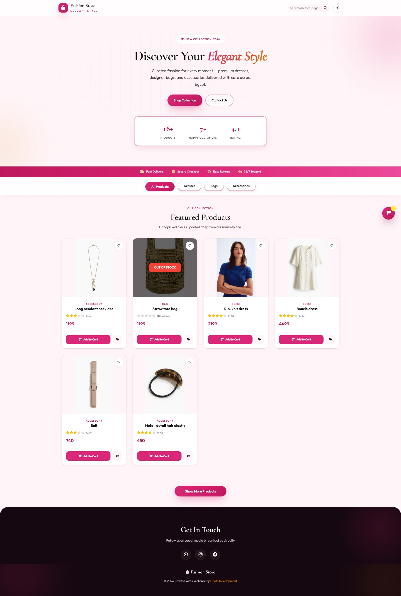
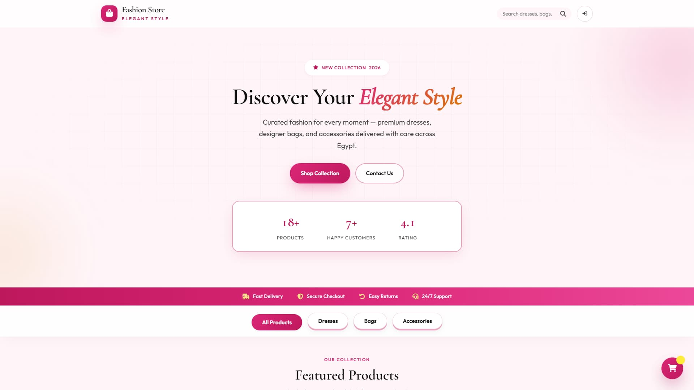
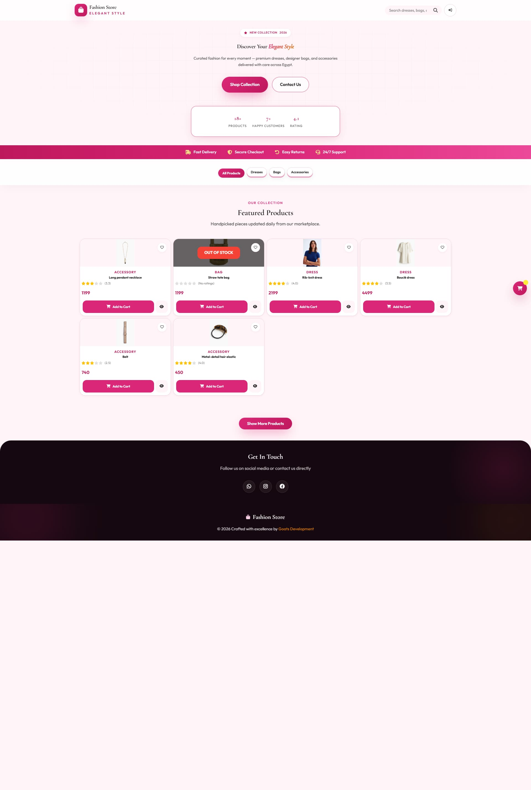
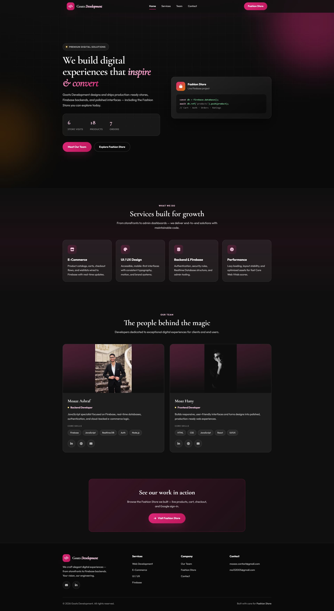
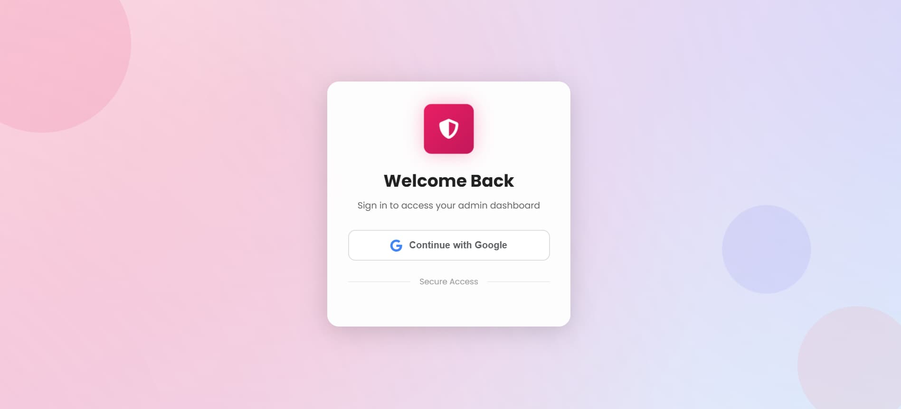
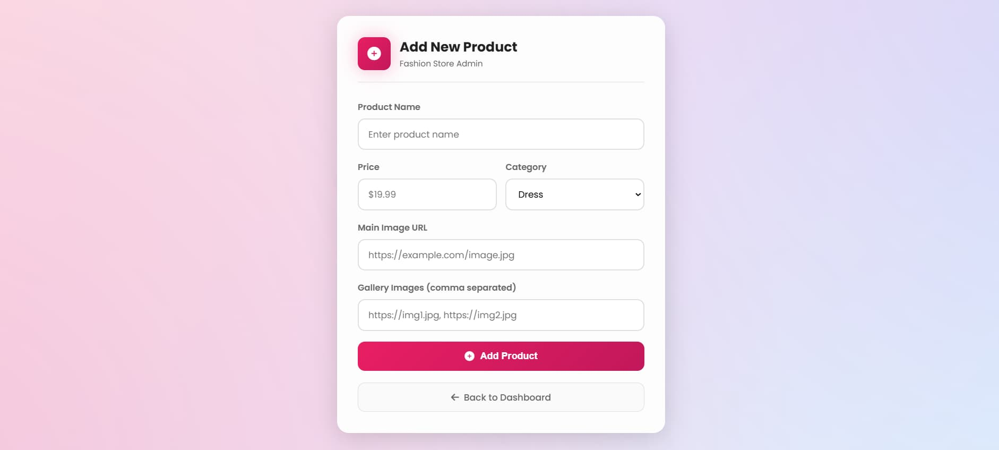
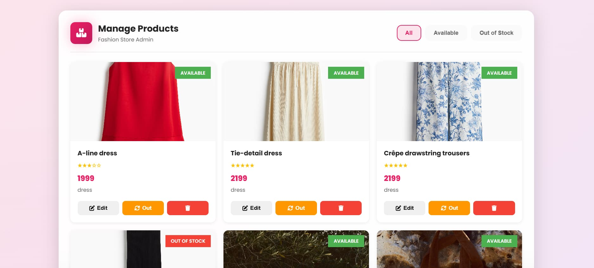
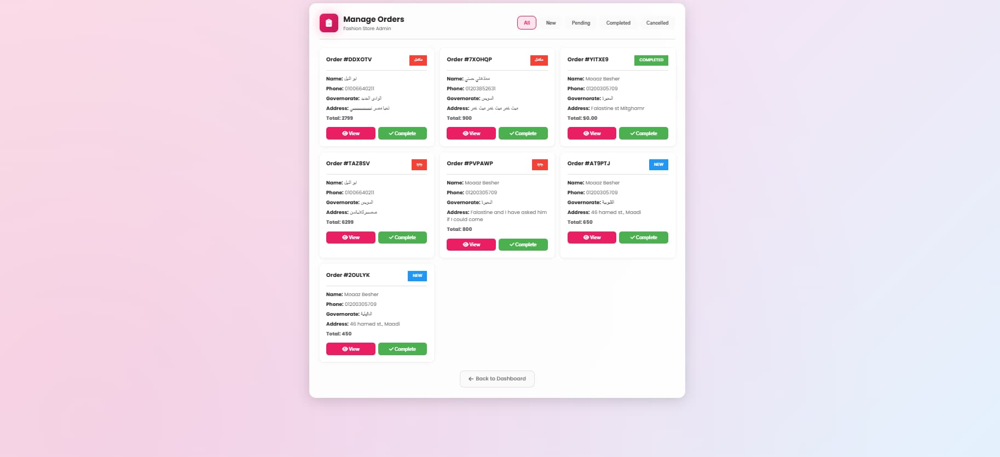
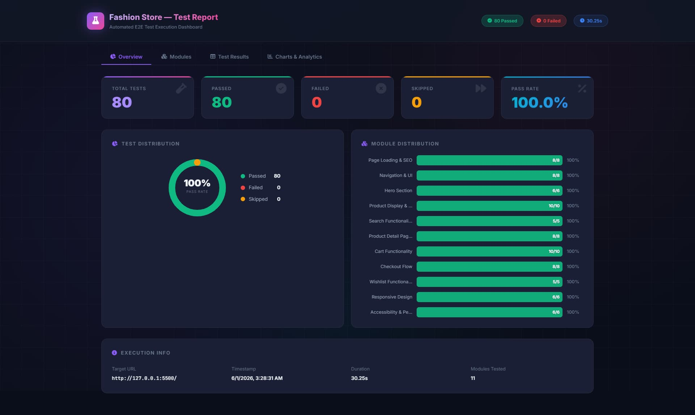
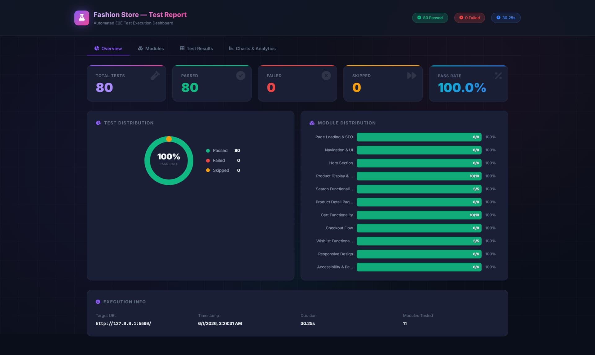

# Fashion Store — Premium E-Commerce Platform

A full-featured, production-ready e-commerce marketplace built with vanilla **HTML, CSS, JavaScript**, and **Firebase**. Designed for the Egyptian market with a modern pink-themed UI, glassmorphism aesthetics, and responsive design.

<p align="center">
  
</p>

---

## Features

### Customer Experience
| Feature | Description |
|---------|-------------|
| Product Catalog | Browse dresses, bags, and accessories with category filters |
| Search | Real-time product search by name |
| Product Detail | Dedicated product page with image gallery, ratings, and related items |
| Shopping Cart | Persistent cart with localStorage, quantity controls, and checkout |
| Wishlist | Save and manage favorite products |
| Ratings & Reviews | 1–5 star rating system for authenticated users |
| User Authentication | Google Sign-In via Firebase Auth |
| User Profile | Order history, wishlist, address management, and settings |

### Admin Panel
| Feature | Description |
|---------|-------------|
| Dashboard | Overview with quick links to all admin tools |
| Product Management | Add, edit, delete products with name, price, category, images |
| Stock Control | Toggle product availability (In Stock / Out of Stock) |
| Order Management | View new/pending/completed/cancelled orders, update status |
| Security | Google Sign-In restricted to admin email addresses |

---

## Screenshots

| Page | Preview |
|------|---------|
| **Homepage** — Product grid, hero section, category filters |  |
| **Product Detail** — Gallery, ratings, add to cart |  |
| **Organization** — Company/team landing page |  |
| **User Profile** — Orders, wishlist, settings |  |
| **Admin Login** — Google Sign-In gateway |  |
| **Add Products** — Admin product creation form |  |
| **Products Manager** — Edit, delete, toggle stock |  |
| **Orders Manager** — View and manage orders |  |

---

## Testing

A fully automated **End-to-End (E2E) test suite** is included, covering all major features using Puppeteer. The runner generates an interactive HTML dashboard and an Excel report.

### Test Modules

| Module | Tests | Scope |
|--------|-------|-------|
| Page Loading & SEO | 8 | HTTP status, meta tags, page titles |
| Navigation & UI | 8 | Navbar rendering, dropdowns, link visibility |
| Hero Section | 6 | Stats display, CTA buttons, scroll behavior |
| Product Display & Filtering | 10 | Grid rendering, category filtering, pagination |
| Search Functionality | 5 | Real-time search, results matching |
| Product Detail Page | 8 | Gallery, ratings, related products |
| Cart Functionality | 10 | Add/remove, quantities, localStorage persistence |
| Checkout Flow | 8 | Form validation, order submission |
| Wishlist Functionality | 5 | Add/remove, toggle state |
| Responsive Design | 6 | Breakpoints, mobile layout |
| Accessibility & Performance | 6 | ARIA labels, contrast, load times |

**Total: 80 tests — 100% pass rate ✅**

### Running Tests

```bash
# Start the live server first, then:
cd test
npm install
node run-tests.js
```

Or double-click `run_tests.bat` (Windows).

### Test Dashboard

The test runner produces an interactive HTML dashboard with:

| Tab | Content |
|-----|---------|
| **Overview** | Pass/fail stats, donut chart, module distribution |
| **Modules** | Per-module breakdown with pass rates |
| **Test Results** | Searchable/filterable table with expandable rows |
| **Charts & Analytics** | Response times, top modules, performance insights |

| Report Page | Preview |
|-------------|---------|
| **Overview** — Summary stats, charts, execution info |  |
| **Modules** — Per-module pass rates |  |
| **Test Results** — Searchable table with filters |  |
| **Analytics** — Response times, performance data |  |

---

## Tech Stack

| Category | Technology |
|----------|------------|
| **Frontend** | HTML5, CSS3, Vanilla JavaScript (ES6+) |
| **Backend** | Firebase Authentication + Realtime Database |
| **Icons** | Font Awesome 6 |
| **Fonts** | Google Fonts — Cormorant Garamond, Outfit |
| **Animations** | CSS keyframes, 3D parallax, glassmorphism |
| **Hosting** | Netlify, Vercel, or any static host |

---

## Project Structure

```
fashion-store/
├── index.html                  # Main storefront
├── product.html                # Product detail page
├── style.css                   # Global styles (2649 lines)
├── script.js                   # Client-side logic (1142 lines)
├── firebase-config.js          # Firebase config template
├── firebase-rules.json         # Database security rules
│
├── screenshots/                # Screenshots for README
├── resources/                  # Static assets (favicon, etc.)
├── run_tests.bat               # Windows batch file to run tests
│
├── test/                       # Automated E2E test suite
│   ├── run-tests.js            # Test runner (Puppeteer)
│   ├── test.html               # Interactive HTML test report
│   ├── test-results.xlsx       # Excel test report
│   └── tests/                  # 11 test modules
│       ├── page-loading.js
│       ├── cart.js
│       ├── checkout.js
│       └── ...
│
├── profile/
│   └── index.html              # User profile page
│
├── organization/
│   ├── index.html              # Company/team landing page
│   ├── style.css
│   ├── script.js
│   └── resources/              # Team member photos
│
├── admin/
│   ├── index.html              # Admin login + dashboard
│   ├── script.js
│   ├── app.js
│   ├── addProducts/            # Add new products
│   ├── productsManager/        # Manage products CRUD
│   └── adminOrders/            # Manage orders CRUD
```

---

## Getting Started

### Prerequisites
- A modern web browser (Chrome, Firefox, Edge, Safari)
- A Firebase project (free tier)

### Installation

```bash
git clone https://github.com/MoaazBesher/fashionStore.git
cd fashionStore
```

### Firebase Setup

1. Go to [Firebase Console](https://console.firebase.google.com/)
2. Create a new project
3. Enable **Authentication** → Google Sign-In
4. Enable **Realtime Database**
5. Copy your Firebase config and replace in these files:
   - `script.js`
   - `admin/index.html`
   - `admin/addProducts/index.html`
   - `admin/productsManager/index.html`
   - `admin/adminOrders/index.html`

```javascript
const firebaseConfig = {
  apiKey: "YOUR_API_KEY",
  authDomain: "YOUR_PROJECT.firebaseapp.com",
  databaseURL: "https://YOUR_PROJECT-default-rtdb.firebaseio.com",
  projectId: "YOUR_PROJECT_ID",
  storageBucket: "YOUR_PROJECT.appspot.com",
  messagingSenderId: "YOUR_SENDER_ID",
  appId: "YOUR_APP_ID"
};
```

6. Deploy the security rules from `firebase-rules.json` to your Firebase Realtime Database

### Run Locally

```bash
# VS Code Live Server
npx live-server --port=5500

# OR Python
python -m http.server 8000

# OR PHP
php -S localhost:8000
```

---

## Responsive Breakpoints

| Device | Breakpoint |
|--------|------------|
| Desktop | > 992px |
| Tablet | 768px – 992px |
| Mobile | 480px – 768px |
| Small Mobile | < 480px |

---

## Design System

### Color Palette
| Color | Hex | Usage |
|-------|-----|-------|
| Primary | `#db2777` | Main accent, buttons |
| Primary Dark | `#be185d` | Hover states |
| Primary Light | `#fdf2f8` | Backgrounds |
| Secondary | `#1e293b` | Text, headings |
| Success | `#10b981` | In stock, positive actions |
| Error | `#ef4444` | Errors, delete |

### Typography
- **Headings:** Cormorant Garamond (serif, elegant)
- **Body:** Outfit (sans-serif, modern)

---

## Admin Access

Admin login is restricted to authorized email addresses. To add or modify admin emails, update the `adminEmails` array in `admin/app.js`.

---

## Developers

| Name | Role | Contact |
|------|------|---------|
| Moaaz Ashraf | Backend Developer | [GitHub](https://github.com/MoaazBesher) |
| Moaz Hany | Frontend Developer | — |

Built with ❤️ by **Goats Development**

---

## License

This project is licensed under the MIT License.

---

## Support

For issues and feature requests, please open an issue on [GitHub](https://github.com/MoaazBesher/fashionStore/issues).
